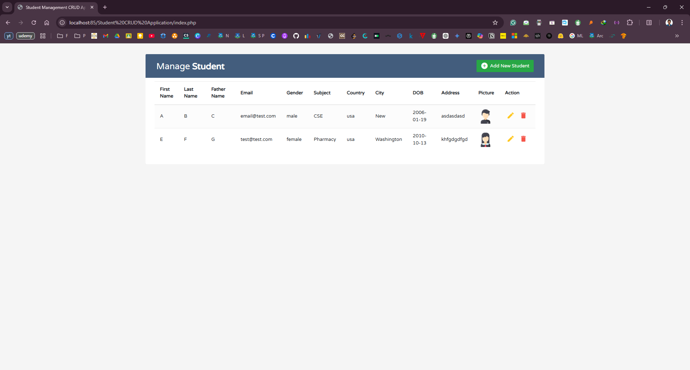

# Student CRUD Application

This is a simple Student Management CRUD (Create, Read, Update, Delete) application built using PHP and MySQL. The application allows you to manage student records, including adding new students, editing existing student details, and deleting student records.

## Features

- Add new student records
- Edit existing student records
- Delete student records
- View all student records in a table
- Responsive design using Bootstrap

## Technologies Used

- PHP
- MySQL
- HTML
- CSS
- Bootstrap
- JavaScript

## Installation

1. Clone the repository to your local machine.
2. Import the `students` database from the provided SQL file.
3. Update the database connection details in the PHP files (`index.php`, `edit.php`, `del.php`).

## Usage

1. Open the application in your web browser.
2. Use the "Add New Student" button to add a new student record.
3. Use the "Edit" button to edit an existing student record.
4. Use the "Delete" button to delete a student record.

## Screenshots

## License

This project is licensed under the MIT License.
